# overshare

> Share your coding-agent sessions as links. Redacted, so you never really overshare.

[](https://www.npmjs.com/package/overshare)
[](https://github.com/crcatala/overshare/actions/workflows/ci.yml)
[](LICENSE)

overshare turns a [Claude Code](https://claude.com/claude-code) or [pi](https://github.com/earendil-works/pi)
session into an unlisted link that anyone can read in a clean web viewer. Secrets, paths and emails
are redacted **on your machine**, the exact payload is scanned again, and only then is it uploaded.

<p align="center"></p>

- **Redacted locally, checked twice.** Known values from your environment and `.env` files, about 1,100
  secret patterns, home paths and emails are scrubbed before upload. If the final re-scan still finds
  something, publishing is refused.
- **Share as much as you mean to.** Four [share modes](#share-modes), from the full transcript down to just
  your prompts. Omitted detail is never uploaded, not merely hidden.
- **No backend.** Shares are files in a secret GitHub gist (or your own R2 bucket) read by a static viewer.
  Delete the gist and the share is gone.
- **Find old sessions fast.** `overshare browse` is a terminal UI to search, preview and publish any
  local session.

## Install

Requires Node.js 22.19 or newer.

```bash
npm install -g overshare     # installs `overshare` and the short alias `ovs`
```

Publishing to a gist uses the [GitHub CLI](https://cli.github.com/): run `gh auth login` once.
Without installing, use `npx overshare <command>`.

## Quick start

```bash
# 1. See what a share looks like, using fake sessions. Nothing is uploaded.
overshare demo

# 2. Find a session: list recent ones, or browse and search interactively.
overshare list
overshare browse

# 3. Preview exactly what would be shared and redacted. Writes nothing.
overshare report --current

# 4. Publish: review, confirm, and get a link.
overshare publish --current
```

`--current` means the session you are in (inside Claude Code), otherwise the newest session for the
current directory. Anywhere a command takes `[session]` you can also pass a session id, an id prefix,
or a transcript file path.

## Common usage

```bash
# Share one session in a chosen mode
overshare publish 3f2a --mode prompts

# Non-interactive: publish only if the report is clean (for scripts and agents)
overshare publish --current --yes

# Machine-readable report (exit 0 clean, 2 needs review, 3 blocked)
overshare report --current --mode full --json

# Redact extra values you know are sensitive, for this run
overshare publish --current --secrets-file ./secrets.txt

# Save a redacted share locally, as JSON or as one self-contained HTML page
overshare export --current -o session.json
overshare export --current --mode brief -o session.html

# Open local share files in the viewer
overshare serve session.json

# Only Claude Code or only pi sessions
overshare list --harness pi -n 30

# Take a share down
overshare delete https://overshare.link/s/#octocat/0123456789abcdef
```

Run `overshare <command> --help` for every option.

## Share modes

The mode is applied **before** redaction and upload, so what a mode leaves out never leaves your machine.

| Mode | What is shared |
| --- | --- |
| `full` | Everything after redaction, with long tool inputs and outputs truncated. |
| `brief` (default) | Prompts and replies. Tool calls collapse into summaries like `Bash ×5 · Edit ×3`; no tool output. |
| `minimal` | Prompts, the final reply of each turn, and tool counts. |
| `prompts` | Only the prompts you typed, each with a one-line activity summary. |

Every mode keeps session metadata: agent, models, repo and branch, duration, token usage and estimated
cost. Readers can step a share *down* to a smaller mode in the viewer, never up.
[More on modes, targets and HTML export](docs/sharing.md).

## Redaction

Each `report`, `export` and `publish` runs the same pipeline and ends with a status:

| Status | Meaning | To publish |
| --- | --- | --- |
| **CLEAN** | Nothing secret-looking found. | `publish --yes` publishes without asking. |
| **NEEDS REVIEW** | Secrets were found and redacted; the report lists each by rule and location. | Confirm with `y`, or `--yes --allow-findings`. |
| **NEEDS CONFIRMATION** | Values that may be secrets could not be redacted and are still in the payload. | Inspect them, then confirm, or `--yes --allow-suspicious`. |
| **BLOCKED** | The final re-scan found a known value, high-confidence secret or home path. | Refused. |

Reports never print a secret value, a fragment of one, or the text around it.

By default overshare reads secret-looking environment variables and the session project's `.env` files,
so it can redact those exact values wherever they appear. Credential stores (`gh`, npm, Claude/pi/Codex
auth files) are opt-in. Pattern matching is best effort, so review before sharing, and if something
leaks, rotate it. [How redaction works and what it reads](docs/redaction.md).

## Use it from your agent

Both integrations add `/share-session [full|brief|minimal|prompts]`. They publish directly when the
report is clean and ask you first otherwise.

**Claude Code** (skill):

```bash
mkdir -p ~/.claude/skills
ln -s "$(npm root -g)/overshare/integrations/claude-code/share-session" ~/.claude/skills/share-session
```

**pi** (extension): passes the exact session file and branch, and records what you typed before pi
expands templates or skills, which `prompts` shares rely on. Reload pi after installing.

```bash
mkdir -p ~/.pi/agent/extensions
ln -s "$(npm root -g)/overshare/integrations/pi/overshare.ts" ~/.pi/agent/extensions/overshare.ts
```

Set `OVERSHARE_BIN` if `overshare` is not on the agent's `PATH`.

## Where shares live

- **Secret GitHub gist** (default). Unlisted, not private: anyone with the link can read it.
- **Your own public Cloudflare R2 bucket** with `--target r2`, under unguessable 128-bit ids.
  [Setup](docs/sharing.md#public-cloudflare-r2-bucket).
- **A single HTML file** from `export -o session.html`: the viewer and session in one page that opens
  offline. It can't be revoked once sent.

Links open in the hosted viewer at <https://overshare.link/s/>. The viewer is static and you can
[host your own](docs/self-hosting.md).

## Documentation

| Guide | Covers |
| --- | --- |
| [Browsing sessions](docs/browse.md) | `overshare browse`: keys, search, the session viewer, settings |
| [Sharing](docs/sharing.md) | Share modes in detail, gist and R2 targets, deleting, single-file HTML |
| [Redaction](docs/redaction.md) | Each redaction layer, report statuses, suspicious values, what is read from your machine |
| [Configuration](docs/configuration.md) | Config file, environment variables, files overshare writes |
| [The viewer](docs/viewer.md) | Share links, token and cost rails, cache misses, design variants, view settings |
| [Self-hosting](docs/self-hosting.md) | Building and deploying your own viewer on Cloudflare or any static host |
| [Development](docs/development.md) | Building from source, fake sessions, architecture, adding a harness |

## Contributing and security

See [CONTRIBUTING.md](CONTRIBUTING.md) for bug reports and local development, and [SECURITY.md](SECURITY.md)
to report a vulnerability privately. Release notes are in [CHANGELOG.md](CHANGELOG.md).

## License

[MIT](LICENSE). The viewer bundles the JetBrains Mono and IBM Plex Sans fonts (and the landing page
Bricolage Grotesque), each under the [SIL Open Font License 1.1](https://openfontlicense.org); their
licenses ship as `font-licenses.txt` beside the viewer and inside every HTML export.
