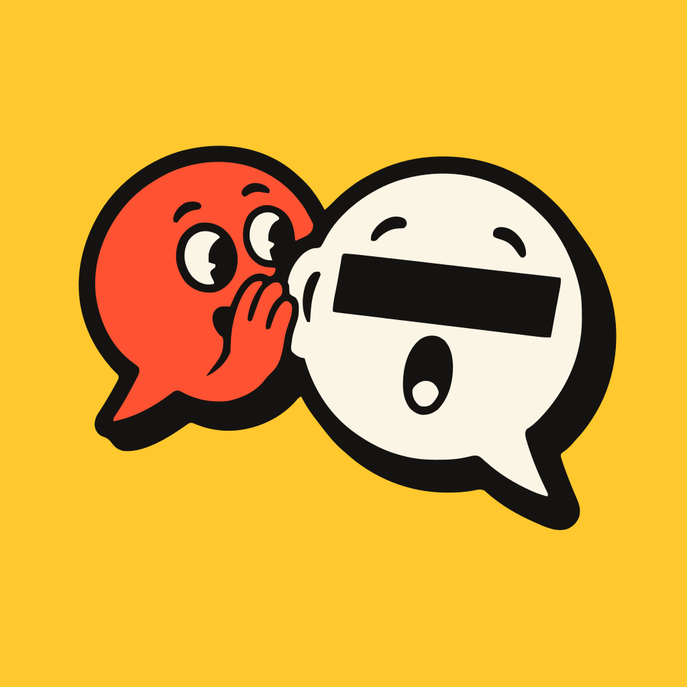
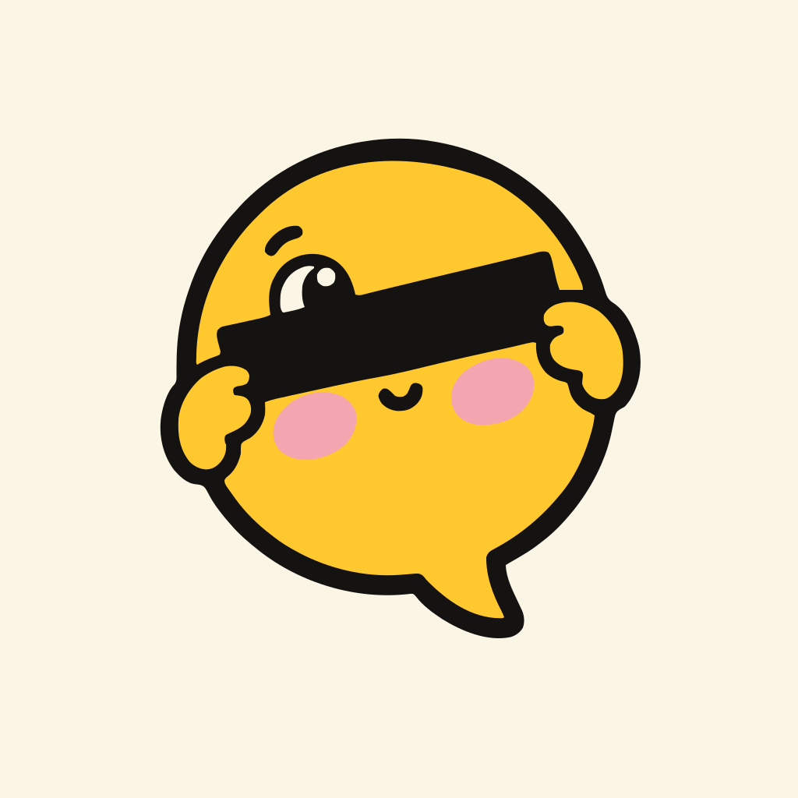

# Brand marks

## Logo: whisper duo

Two speech bubbles: the red one whispers, and the cream one hears it with its eyes redacted.
It is shared, but the secret stays covered.

- `whisper-duo.svg` is the source vector, on its mustard background.
- `whisper-duo.webp` is the original generated image it was traced from.
- `site/logo.svg` is the version the landing page uses (favicon, nav, receipt and footer).
  It is the same artwork cropped onto a rounded mustard tile.
- `viewer/src/favicon.svg` is a copy of it, the session viewer's tab icon. A test keeps the two
  identical, so change both together.
- `site/public/favicon.ico` (16 and 32px) and `site/public/apple-touch-icon.png` (180px, square
  corners for iOS to mask) are rendered from it. Run `node scripts/favicons.mjs` after changing
  the logo; it needs Chromium (`$CHROME`, default `chromium`).

## Alternate: shy peek

A mustard bubble holding a censor bar over its eyes, peeking over one end. It is kept here
as a possible alternate and is not used anywhere yet.

- `alt-shy-peek.svg` is the source vector.
- `alt-shy-peek.webp` is the original generated image.

## Palette

The vectors use only the landing page colours from `site/src/site.css`:
tomato `#ff5233`, mustard `#ffc82e`, cream `#fbf5e6` and ink `#151311`. The alternate's
blush cheeks also use pink `#f4a6b0`.

## How these were made

Both marks were generated with OpenAI GPT Image, then traced to SVG with
[VTracer](https://github.com/visioncortex/vtracer) after snapping every pixel to the palette.
To regenerate or riff on one, pass its `.webp` as a reference image along with its prompt.

Whisper duo:

> Mascot logo of two overlapping speech bubble characters: a small tomato red #FF5233 one
> whispering behind its hand into the ear of a larger cream #FBF5E6 one, whose eyes are covered
> by a black censor bar like sunglasses and who has a surprised O mouth. Thick near-black #151311
> outlines, hard offset flat shadow, flat vector sticker style, compact composition, plain mustard
> yellow #FFC82E background. No text.

Shy peek was a reference-image edit of an earlier shy mascot:

> Adorable mascot logo: a small round speech bubble character with tiny stubby hands holding a
> black rectangular censor bar up in front of its own eyes, shy and bashful, pink blush cheeks
> below the bar, little tail at the bottom. Mustard yellow #FFC82E body, thick near-black #151311
> outline, flat vector, chunky sticker style, plain cream #FBF5E6 background. No text.

> Same mustard yellow speech bubble mascot from the reference, holding the black censor bar with
> its tiny hands. Change: it lowers one end of the bar slightly so one curious eye peeks out over
> it, blush cheeks, tiny smile. Same thick black outline, flat vector chunky sticker style, plain
> cream background. No text.
